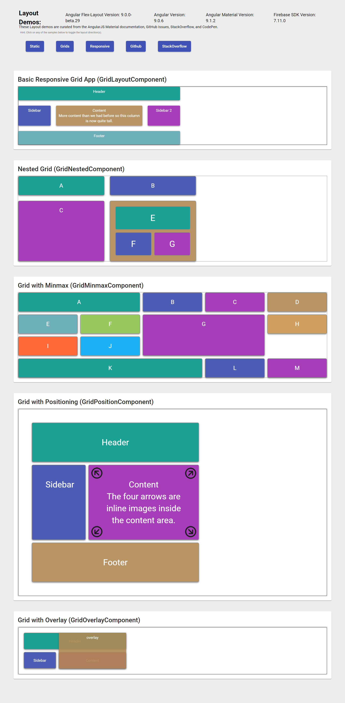

# Angular Flex Layout Demo


This project was generated with [Angular CLI](https://github.com/angular/angular-cli) version 7.2.

It was created in March 2019.

It is loosely based on the [Demo App](https://github.com/angular/flex-layout/tree/master/src/apps/demo-app) provided with Angular Flex Layout.

## Differences with original Demo App
* I have split out the inline Styles and HTML into separate .scss and .html files.
* Moved `style=""` within html to the separate component .scss file as a named class and then replaced the inline style with a class="" reference in the html.
* I have added three Angular services to provide information about:
  * Which version of Angular is being used
  * Which version of Angular Material is being used
  * Which version of Angular Flex Layout is being used
* I created separate *Development* vs. *Production* configurations inside `angular.json` and use them in my modified version of `package.json` which contains separate `ng build` and `ng serve` commands for both configurations.
* I turned on route tracing in `routing.module.ts` via `ExtraOptions` as shown below (only the most significant code snippets are shown here):
```typescript
import { Routes, RouterModule, ExtraOptions } from '@angular/router';

const routeOptions: ExtraOptions = {
  enableTracing: true
};

 imports: [RouterModule.forRoot(DEMO_APP_ROUTES, routeOptions)],
```

## Additional Information
* [Angular Flex-Layout on GitHub](https://github.com/angular/flex-layout)
* [Angular Flex WiKi](https://github.com/angular/flex-layout/wiki)
* [Online Demos](https://tburleson-layouts-demos.firebaseapp.com/)
* [Demo Source Code this repository is based upon](https://github.com/angular/flex-layout/tree/master/src/apps/demo-app)
* [Article: Angular In Depth - Angular Flex-Layout](https://blog.angularindepth.com/angular-flex-layout-flexbox-and-grid-layout-for-angular-component-6e7c24457b63)

## Firebase
https://ng-flex-layout-demo-242817.firebaseapp.com

## Firebase Deploy - What Mother Never Told You About Deploying an Angular-CLI 8.x project to Firebase hosting
IMPORTANT:
1. Modify `angular.json` to remove anything after the word `dist` in the following line.  Remove any leading forward slash `/` characters too.
    Example before:
    ```typescript
    "outputPath": "dist/angular-flex-layout-demo-app",
    ```
    Example after:
    ```typescript
    "outputPath": "dist",
    ```

2. Modify `firebase.json` to remove anything after the word `dist`
    Example before:
    ```typescript
      "public": "dist/angular-flex-layout-demo-app",
    ```
    Example after:
    ```typescript
     "public": "dist",
    ```

3. EXTREMELY IMPORTANT, ESPECIALLY WHEN MOVING PROJECT TO A NEW MACHINE !!!!
    ```
    firebase use ng-flex-layout-demo-242817
    ```

After deploying, view your app at astute-coda-242712.web.app.

https://ng-flex-layout-demo-242817.web.app/

or

https://ng-flex-layout-demo-242817.firebaseapp.com/

